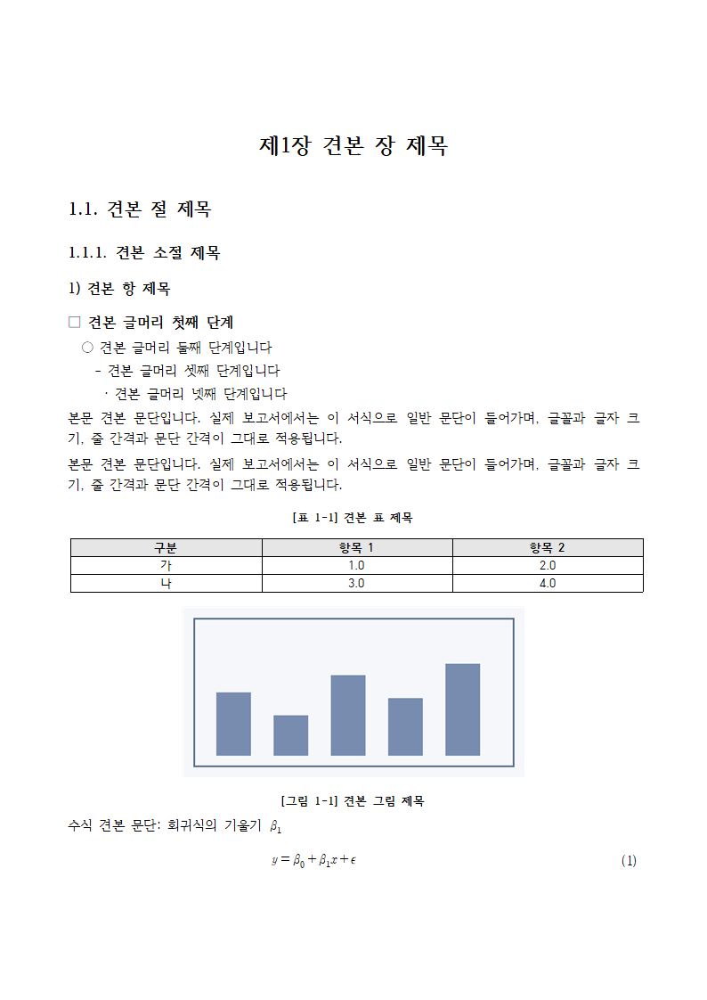
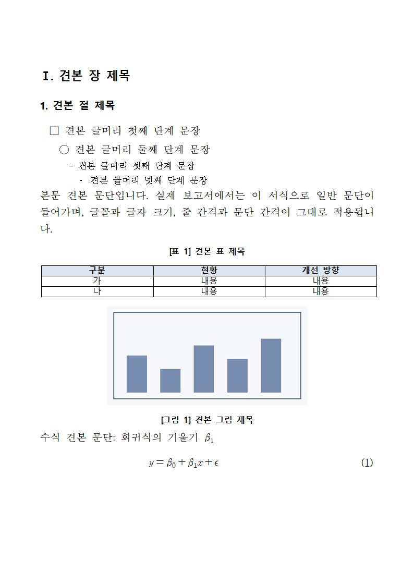
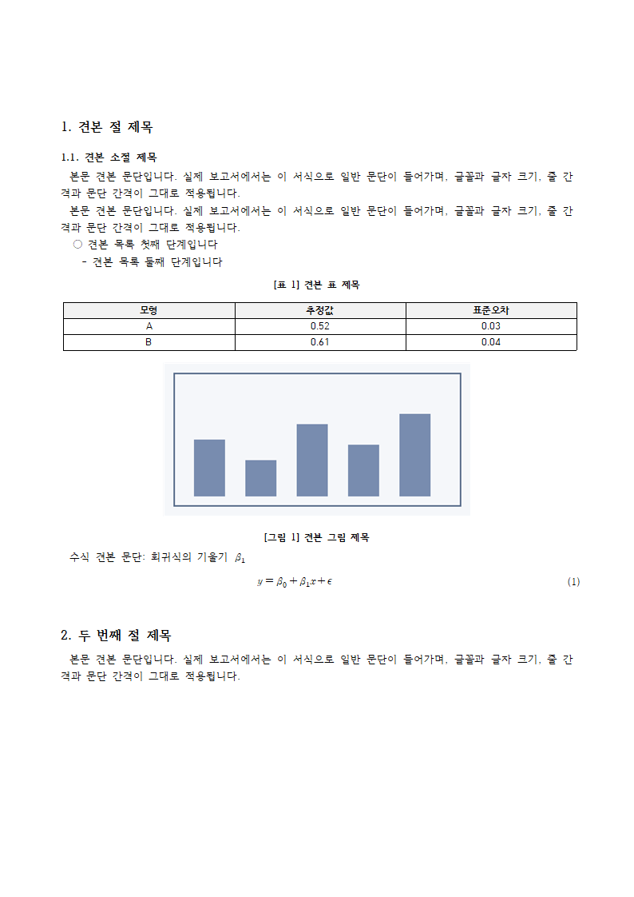
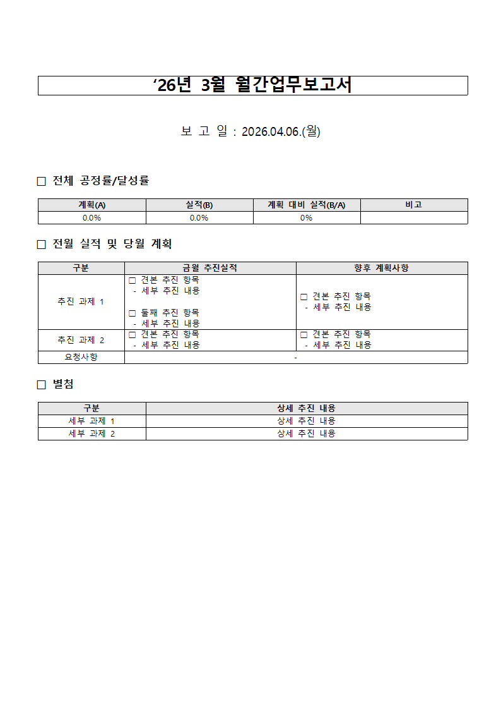

# hwp-helper

Claude와 함께 **한글(HWP/HWPX) 문서를 서식 그대로** 쓰는 플러그인입니다.

**👉 설치·사용 안내 페이지: https://chshoong.github.io/hwp-helper/**

- 국가R&D 보고서, 기관 양식(월간보고서·진도 보고), 공문서·개조식, 학술 논문 형식을 지원합니다.
- 양식에 이미 있는 서식(글꼴·글머리·표·그림 캡션·수식)을 복제해 쓰므로 함초롬바탕 같은 글꼴, 표 테두리, 수식 크기가 깨지지 않습니다.
- 한글이 설치된 Windows에서는 한글로 미리보기·.hwp 변환·수식 크기 재계산까지 하고, 한글이 없어도(Mac, claude.ai) .hwpx 파일을 만듭니다.

## 설치

### Claude Code (데스크톱 앱·터미널)

```
/plugin marketplace add chshoong/hwp-helper
/plugin install hwp-helper@hwp-helper
```

GitHub에 올리기 전이라면 내려받은 폴더 경로로 추가합니다.

```
/plugin marketplace add C:/Users/<사용자>/Documents/hwp-helper
/plugin install hwp-helper@hwp-helper
```

필요한 파이썬 부품(`lxml`, `Pillow`)이 없으면 Claude가 설치해도 되는지 먼저 묻습니다.

### claude.ai

`python scripts/build_skill_zip.py`로 만든 `dist/hwp-helper-skill.zip`을 설정 → 기능 → 스킬에 올립니다. claude.ai에서는 한글이 없으므로 기본 모드(.hwpx 생성, 수식 크기는 추정)로 동작합니다.

## 처음 쓰는 법

그냥 말로 부탁하면 됩니다.

> 이 분석 결과(results.md, figs/)로 국가R&D 최종보고서 3장을 한글로 써줘

Claude가 형식(양식 파일이 있는지, 어떤 프리셋인지)을 묻고 → 목차를 보여 확인받고 → 본문을 쓴 뒤 → 쪽 미리보기와 검토 결과(번호·참조·날짜·빈 칸)를 함께 보여 줍니다.

> 3월 월간보고서 양식(월간보고서.hwp)에 이번 달 실적 채워줘

양식의 표 칸을 찾아 채울 내용을 먼저 보여 주고, 확인받은 뒤 채웁니다. 원본 파일은 절대 덮어쓰지 않습니다.

명령으로도 부를 수 있습니다: `/hwp-helper:hwp-write`, `/hwp-helper:hwp-fill`, `/hwp-helper:hwp-review`, `/hwp-helper:hwp-convert`.

## 프리셋 4종

양식 파일이 없을 때 고르는 기본 서식입니다. 기관 양식 파일이 있으면 그것을 쓰는 것이 언제나 우선입니다.

| 국가R&D 보고서형 `rnd-report` | 공문서·개조식 `gov-brief` | 학술 논문형 `paper` | 월간·진도 `progress` |
|---|---|---|---|
|  |  |  |  |
| 함초롬바탕 11pt, 제1장·1.1.·1.1.1., `[표 1-1]` | 휴먼명조, Ⅰ.·1.·□○-· 개조식 | 함초롬바탕 10pt, 1.·1.1., 첫 줄 들여쓰기 | 맑은 고딕 표 양식, 칸 채우기 |

## 한글이 있을 때와 없을 때

| | 한글 설치된 Windows | 한글 없음 (Mac, claude.ai) |
|---|---|---|
| .hwpx 만들기·채우기·검토 | 됨 | 됨 |
| .hwp 읽기·저장, PDF | 됨 | 한글에서 HWPX로 저장해 달라고 안내 |
| 쪽 미리보기 | 됨 | 없음 |
| 수식 크기 | 한글이 다시 계산 | 추정(한글 실측으로 보정) |

## 엔진 명령

플러그인 안에서 Claude가 쓰는 명령입니다. 직접 써도 됩니다(`python hwpx.py <명령>`).

| 명령 | 하는 일 | 한글 필요 |
|---|---|---|
| `presets` | 프리셋 목록 | 아니요 |
| `inspect 파일` | 쪽 크기, 문단·표·그림·수식 개수, 글꼴, 스타일 요약 | .hwp일 때만 |
| `validate 파일` | 한글에서 깨질 만한 부분 검사 | .hwp일 때만 |
| `convert 원본 결과.pdf` | hwp ↔ hwpx ↔ pdf 변환 | 예 |
| `preview 파일 폴더` | 쪽마다 PNG 미리보기 | 예 |
| `read 파일 [--anchors]` | 문서를 보고서 마크다운으로 읽기 (수식은 LaTeX) | .hwp일 때만 |
| `samples 양식` | 양식에서 찾은 역할별 견본 서식 보기 | .hwp일 때만 |
| `render 양식 내용.md 결과.hwpx` | 내용을 양식 서식 그대로 넣기 (`--replace 시작:끝`, `--mode append`, `--preview 폴더`) | 결과가 .hwp이거나 미리보기일 때 |
| `equations 파일 결과` | 수식 크기를 한글로 다시 계산 (render는 한글이 있으면 자동) | 예 |
| `fields 양식` | 양식의 표 칸과 채우기 주소(`@칸 표2 \| 행 \| 열`) 보기 | .hwp일 때만 |
| `fill 양식 지시문.md 결과` | `@칸`·`@행수`·`@바꾸기`로 양식 채우기 (칸 서식·메모 유지) | 미리보기일 때 |
| `review 파일` | 날짜·요일·보고 기간·번호·참조·안내 문구·빈 칸·글꼴 검토 | .hwp일 때만 |
| `renumber 파일 결과` | 표·그림·수식 번호 다시 매기기 (본문 참조도 고침) | .hwp일 때만 |

양식 자리에는 파일 대신 프리셋 이름(`rnd-report` 등)을 써도 됩니다. `--json`을 붙이면 기계가 읽는 JSON으로 출력합니다.

쓰는 법 자세히: [보고서 마크다운](skills/hwp-helper/reference/markdown.md) · [수식](skills/hwp-helper/reference/equations.md) · [양식 채우기](skills/hwp-helper/reference/form.md) · [프리셋](skills/hwp-helper/reference/presets.md) · [문제 해결](skills/hwp-helper/reference/troubleshooting.md)

## 개발

```bash
python -m pip install -e ".[dev]"
python -m pytest
```

- 한글이 없는 PC에서는 한글이 필요한 테스트가 자동으로 건너뛰어집니다.
- `private/`(git 제외)에 실제 보고서(`monthly.hwpx`, `final.hwpx`)가 있으면 실제 문서 검증도 함께 돕니다. 이 폴더는 저장소·zip에 절대 들어가지 않습니다.
- 프리셋 다시 만들기: `python scripts/build_presets.py` (한글 필요)
- claude.ai용 zip: `python scripts/build_skill_zip.py`

## 라이선스

MIT — [LICENSE](LICENSE)
